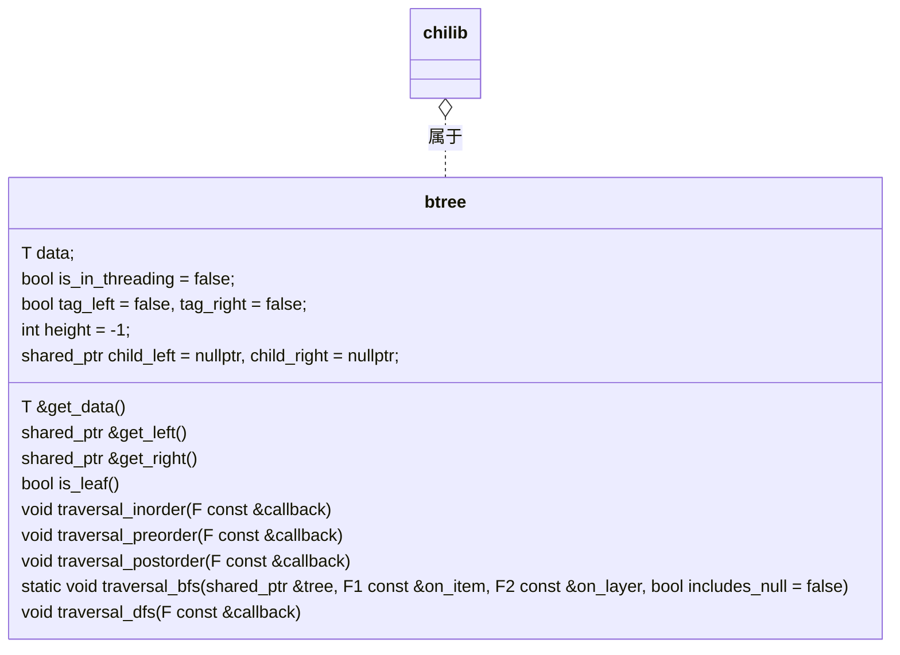
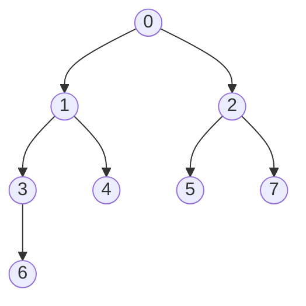

## 使用说明 - chilib::btree

> `chilib`是Chiro(Chiro2001@163.com)在数据结构课中，尝试使用`C++`语言和自己有限的知识实现`C++`库中部分`STL`库的功能的一个库。以下是`chilib::btree`的使用说明。

### 二叉树结构

本程序的二叉树数据结构以及对应类方法表示如下：





### 获取二叉树信息

```cpp
// 获取节点数据
T &get_data() { return data; }
// 获取左右子树
shared_ptr<btree> &get_left() { return child_left; }
shared_ptr<btree> &get_right() { return child_right; }
// 是否线索化
bool &get_is_threading() { return is_in_threading; }
// 线索化标志
bool &get_tag_left() { return tag_left; }
bool &get_tag_right() { return tag_right; }
// 获取当前高度
int &get_height() { return height; }
// 是否是叶子节点
bool is_leaf();
```

### 建立二叉树

```cpp
// 用 std::make_shared 建立节点
root = std::make_shared<btree<int>>(1);
// 用遍历方法建树
chilib::vector<int> line{1, 2, 3, 5, 6};
auto p = line.begin();
bt::traversal_bfs(root, [&p, &line](std::shared_ptr<bt> &tr, bool *end_all) -> bool {
    // 在 includes_null 情况下，需要设置 end_all 结束遍历
    if (tr != nullptr) return true;
    tr = std::make_shared<bt>(*p);
    ++p;
    if (p == line.end()) {
        *end_all = true;
        return false;
    }
    return true;
}, [](std::shared_ptr<bt> &tr, int height, bool *end_all) -> bool {
    // 这个函数是当遍历完一层之后触发的，height 表示下一层的高度
    // printf("height now: %d\n", height);
    return true;
    // includes_null 表示在遇到空节点的时候是否继续运行，设置为 true 则回调函数可以得到空节点的指针
}, true);
```

### 遍历二叉树

```cpp
// 前序、中序、后序遍历
auto print_order = [](std::shared_ptr<btree<int>> &tr) -> bool {
    // tr 就是当前遍历到的节点
    return true;
}
root->traversal_preorder(print_order);
root->traversal_inorder(print_order);
root->traversal_postorder(print_order);
// 深度优先遍历，会额外传一个遍历经过的栈
root->traversal_dfs([](bt &tr, chilib::vector<bt> &stack) -> bool {
    // 遇到叶子节点就向上计算经过的栈
    if (tr.is_leaf()) {
        printf("visit stack: ");
        for (auto &t : stack) printf("%d ", t.get_data());
        puts("");
    }
    return true;
});
// 宽度优先遍历
btree<int>::traversal_bfs(root,
                          [](std::shared_ptr<bt> &tr, bool *) -> bool {
                              // includes_null 默认为否，此时返回 false 会终止 bfs 向下继续遍历
                              return true;
                          },
                          [](std::shared_ptr<bt> &tr, int height, bool *end_all) -> bool { return true; }
                         );
```

### 删除二叉树

```cpp
root->traversal_preorder([](btree<int> &tr) -> bool {
    if (tr.get_data() == 9) {
        // 删除一些节点
        tr.get_left() = nullptr;
        tr.get_right() = nullptr;
    }
    return true;
});
// 删除整个二叉树
root = nullptr;
```

