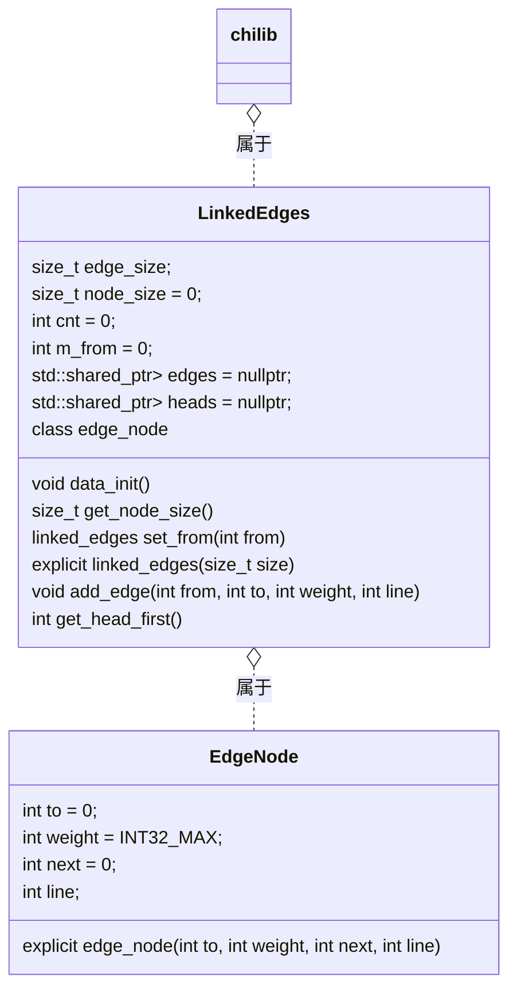

## 使用说明 - chilib::linked_edges

> `chilib`是Chiro(Chiro2001@163.com)在数据结构课中，尝试使用`C++`语言和自己有限的知识实现`C++`库中部分`STL`库的功能的一个库。以下是`chilib::linked_edges`的使用说明。

### 使用

包含文件：`linked_edges.hpp`。

示例：

```cpp
#include <cstdio>
#include "chilib/linked_edges.hpp"

int main() {
  // 最大节点数
  const int EDGES_MAX = 3;
  chilib::linked_edges edges(EDGES_MAX);
  // 添加边
  edges.add_edge(1, 2, 1);
  edges.add_edge(2, 1, 1);
  // 遍历边
  for (int from = 1; from < EDGES_MAX; from++)
    for (const auto &edge: edges.set_from(from))
      printf("%d ==%d==> %d\n", from, edge.weight, edge.to);
  return 0;
}
```

### 接口说明

```cpp
  /*!
   * 构造函数
   * @param size 最大节点编号
   */
  explicit linked_edges(size_t size);
  /*!
   * 设置容器遍历的边起点节点
   * @param from 起点节点
   * @return 已经改变之后的链式前向星对象引用
   */
  linked_edges &set_from(int from);
  /*!
   * 加单向边
   * @param from
   * @param to
   * @param weight
   */
  void add_edge(int from, int to, int weight);
  /*!
   * 取得第一个有边的节点
   * @return
   */
  int get_head_first();
```


### 数据结构



