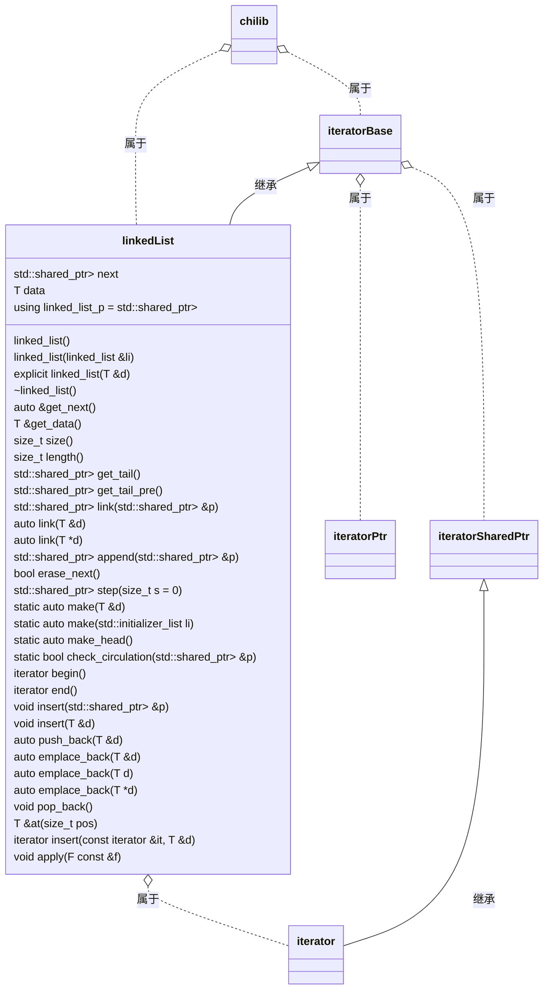
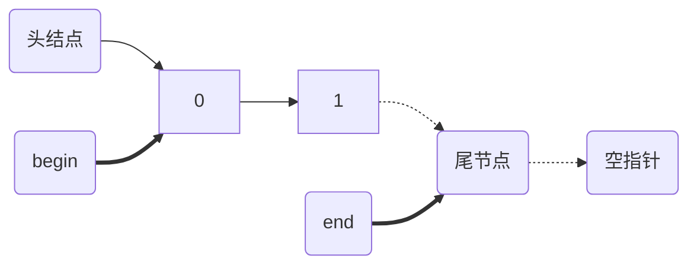

## 使用说明 - chilib::linked_list

> `chilib`是Chiro(Chiro2001@163.com)在数据结构课中，尝试使用`C++`语言和自己有限的知识实现`C++`库中部分`STL`库的功能的一个库。以下是`chilib::linked_list`的使用说明。

### 链表结构

本程序的链表数据结构表示如下：





### 获取链表信息

```cpp
linked_list::get_next(); 	// 获取下一个节点的指针
linked_list::get_data();	// 获取本节点的数据
linked_list::size(); 		// 获取以这个节点为头指针计算的链表长度
linked_list::length();		// 同 size()
linked_list::get_tail();	// 得到尾指针
linked_list::get_tail_pre();// 得到尾指针的前一个指针
linked_list::step(s);		// 获取往下 s + 1 个节点的指针
linked_list::begin();		// 得到首迭代器（如上图）
linked_list::end();			// 得到尾迭代器（如上图）
```


### 建立链表/初始化节点

```cpp
// 生成链表头指针，头指针不包含数据，仅方便链表管理
linked_list_p<int> head = linked_list<int>::make_head();
// 生成含数据的一个链表节点
int d0 = 0;
linked_list_p<int> node = linked_list<int>::make(d0);
// 直接用数据生成一串链表
auto head2 = linked_list<int>::make({9, 7, 5});
```

### 添加数据

```cpp
// 方式1：把节点链接到节点之后
head->link(node);		// 此时数据为 head(空) --> node(0)
// 方式2：直接链接一个数据到这个节点之后
d0 = 1;
head->link(d0);			// 此时数据为 head(空) --> (1)，原来的node(0)被挤掉
// 方式3：在节点之后插入一个数据或者节点，原来节点之后的数据还在
d0 = 3;
head->insert(d0);		// 此时数据为 head(空) --> (3) --> (1)
head->insert(node);		// 此时数据为 head(空) --> node(0) --> (3) --> (1)
// 方式4：在当前节点之后添加一串链表，原来节点之后的数据还在
node->append(head2->get_next());
head2 = nullptr;
// 此时数据为 head(空) --> node(0) --> [(9) --> (7) --> (5)] --> (3) --> (1)
// 方式5：向尾部添加数据
head->emplace_back(10);
// 此时数据为 head(空) --> node(0) --> [(9) --> (7) --> (5)] --> (3) --> (1) --> (10)
```

### 遍历数据

```cpp
// 方式1：利用指针遍历
auto p0 = head->get_next();
while (p0 != nullptr) {
    // Do something
    p0 = p0->step();
}
// 方式2：利用迭代器
for (auto p : head) {
    // Do something
}
```

### 修改数据

```cpp
// 此时数据为 head(空) --> node(0) --> [(9) --> (7) --> (5)] --> (3) --> (1) --> (10)
// 你可以遍历修改数据
for (auto &p : head) {
    p.get_data() -= 3;
}
// 也可以用 lambda 函数执行
head->apply([](auto &p){
    p.get_data() += 6;
})
// 此时数据为 head(空) --> [3, 12, 10, 8, 6, 4, 13]
// 可以修改某一个位置的数据
head->at(3) = -1;
head[2] = -3;
// 此时数据为 head(空) --> [3, 12, -3, -1, 6, 4, 13]
// 可以删除数据
head->pop_back();
// 此时数据为 head(空) --> [3(node), 12, -3, -1, 6, 4]
node->erase_next();
// 此时数据为 head(空) --> [3(node), -3, -1, 6, 4]
```

### 删除链表

```cpp
// 此时数据为 head(空) --> [3(node), -3, -1, 6, 4]
node = nullptr;
// 此时内存未释放
head = nullptr;
// 此时内存已经被完全释放
```

