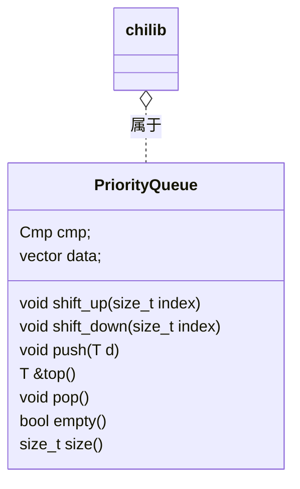
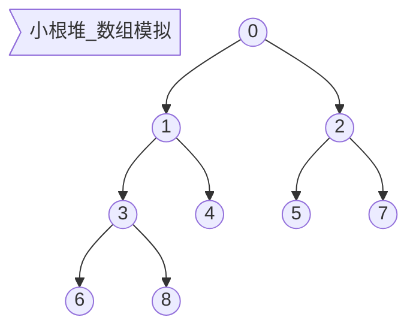

## 使用说明 - chilib::priority_queue

> `chilib`是Chiro(Chiro2001@163.com)在数据结构课中，尝试使用`C++`语言和自己有限的知识实现`C++`库中部分`STL`库的功能的一个库。以下是`chilib::priority_queue`的使用说明。

### 使用

1. 包含文件：`queue.hpp`
2. `chilib::priority_queue<int, chilib::greater<int>> q;`
3. `q.push(1);`
4. `q.pop();`

详细：

```cpp
//
// Created by Chiro on 2021/5/1.
//

#include <cstdio>
#include <cstdlib>
#include "chilib/queue.hpp"

int main() {
  chilib::priority_queue<int, chilib::less<int>> q;
  for (int i = 1000; i >= 0; i--) {
    int t = rand() % 1000;
    q.push(t);
    printf("pushed: %d\n", i);
  }
  while (!qs.empty()) {
    printf("%d\n", q.top());
	q.pop();
  }
  return 0;
}
```

### 接口说明

大致和`STL`库一致，区别在~~性能比`STL`低~~、只会使用`chilib::vector`作容器。

```cpp
  /*!
   * 向队列尾部添加元素
   * @param d 元素
   */
  void push(T d);
  /*!
   * 取队列头元素
   * @return 元素引用
   */
  T &top();
  /*!
   * 弹出队列头元素
   */
  void pop();
  /*!
   * 判断队列是否为空
   * @return 是否为空
   */
  bool empty();
  /*!
   * 取得队列长度
   * @return 队列长度
   */
  size_t size();
```

### 数据结构





